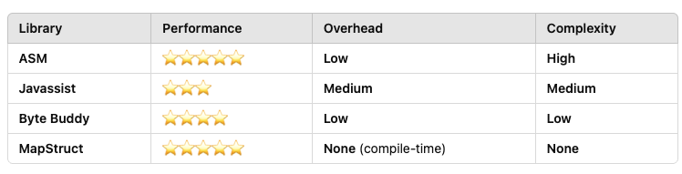

# lite-mapper
POC for a converter framework in Java or other JVM-based technology

# Convertion strategies benchmak

```shell
MapperBenchmark.benchmarkAsm                     avgt    5  ≈ 10⁻⁵           ms/op
MapperBenchmark.benchmarkCachedReflectionMapper  avgt    5   0.005 ±  0.005  ms/op
MapperBenchmark.benchmarkJavassist               avgt    5  ≈ 10⁻⁵           ms/op
MapperBenchmark.benchmarkMapStruct               avgt    5  ≈ 10⁻⁵           ms/op
MapperBenchmark.benchmarkReflectionMapper        avgt    5   0.005 ±  0.008  ms/op

```

# Why only ASM and javaassit 


